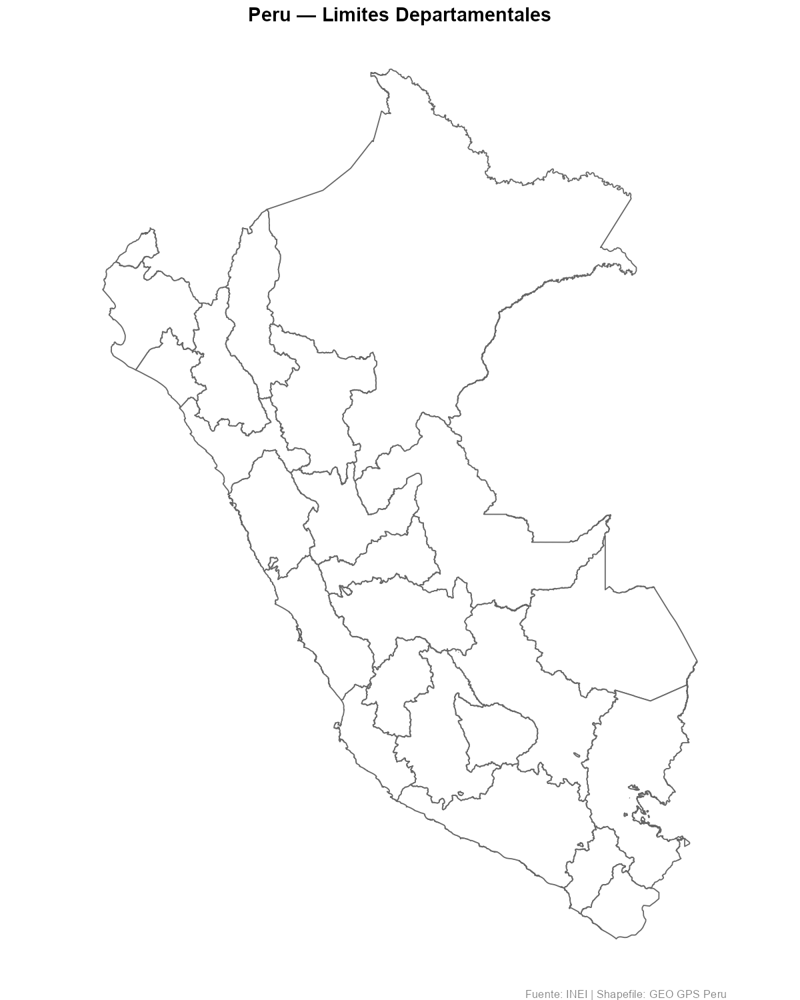
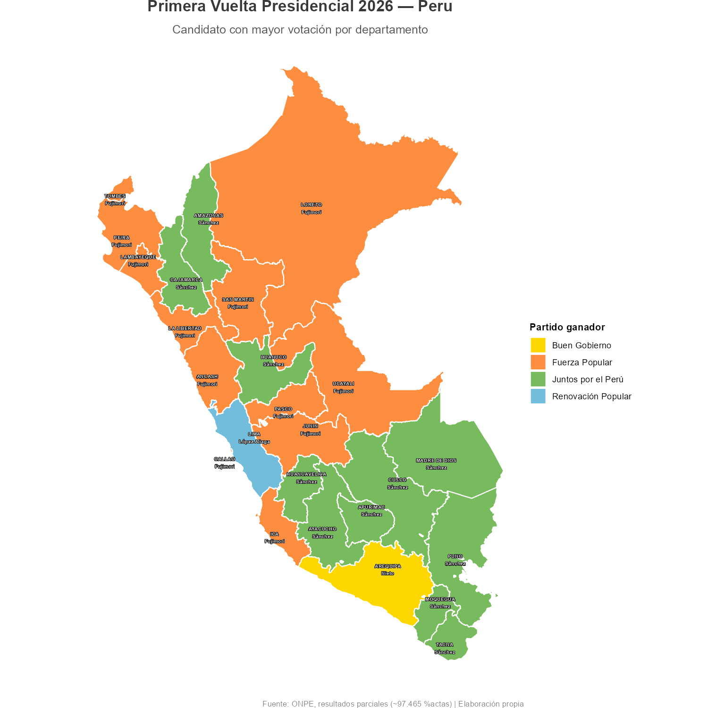
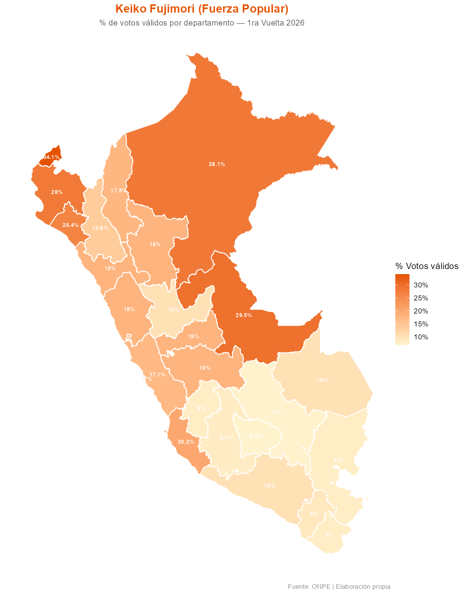
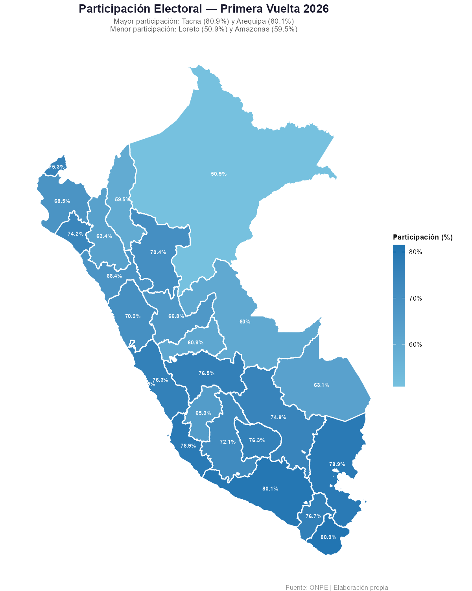
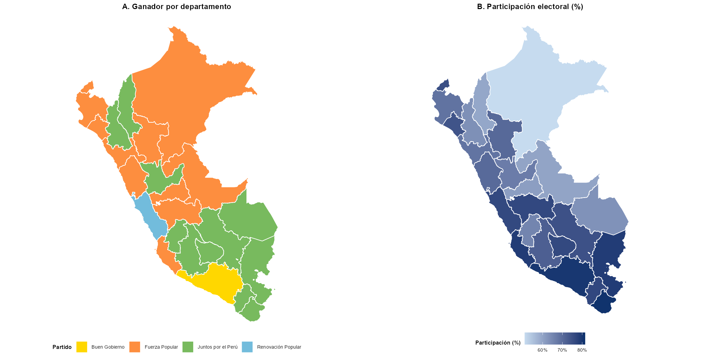
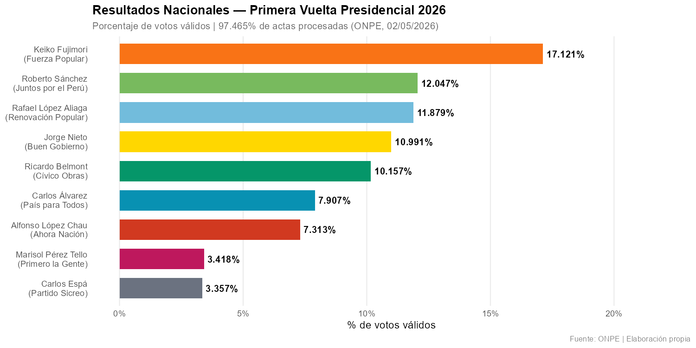

# Tutorial: Elaboración de Mapas del Perú en R
**Elecciones Presidenciales 2026 — Primera Vuelta (ONPE)**

## Descripción

Tutorial paso a paso para crear mapas temáticos del Perú en R, usando los resultados oficiales de la primera vuelta de las Elecciones Generales 2026 según la ONPE (97.465% de actas procesadas al 02/05/2026).

---

## Tutorial base seleccionado

[rmaps-peruvian-case](https://github.com/rmcondor/rmaps-peruvian-case) de @rmcondor — el más completo en español, orientado a Perú, con código reproducible y datos del INEI.

---

## Paquetes necesarios

```r
install.packages(c("sf", "tidyverse", "ggrepel", "viridis",
                   "scales", "cowplot", "RColorBrewer", "leaflet"))
```

---

## Estructura del repositorio

```
tutorial_rmapa_victoria/
├── README.md
├── tutorial_mapa_peru_electoral_2026.Rmd
└── inputs/
    └── shapefiles/
        ├── LIMITE_DEPARTAMENTAL_INEI_geogpsperu.shp
        └── ...
```

---

## Flujo de trabajo

```
1. Descargar shapefile de GEO GPS Perú
2. Leer con sf::st_read()
3. Calcular centroides para etiquetas
4. Preparar datos electorales ONPE
5. Unir shapefile + datos con left_join()
6. Visualizar con ggplot2::geom_sf()
7. Mapa interactivo con leaflet
```

---

## Resultados electorales — Primera Vuelta 2026

| Candidato | Partido | % Votos válidos |
|-----------|---------|----------------|
| Keiko Fujimori | Fuerza Popular | 17.121% |
| Roberto Sánchez | Juntos por el Perú | 12.047% |
| Rafael López Aliaga | Renovación Popular | 11.879% |
| Jorge Nieto | Buen Gobierno | 10.991% |
| Ricardo Belmont | Partido Cívico Obras | 10.157% |

Fuente: ONPE, 97.465% de actas procesadas al 02/05/2026.

---

## Mapas generados

### Mapa base


### Ganador por departamento


### Votos de Keiko Fujimori por departamento


### Participación electoral


### Panel comparativo


### Resultados nacionales


---

## Fuentes

- Shapefile: [GEO GPS Perú](https://www.geogpsperu.com)
- Resultados ONPE: [resultadoelectoral.onpe.gob.pe](https://resultadoelectoral.onpe.gob.pe)
- Tutorial base: [rmaps-peruvian-case](https://github.com/rmcondor/rmaps-peruvian-case)
- Documentación sf: [r-spatial.github.io/sf](https://r-spatial.github.io/sf/)
